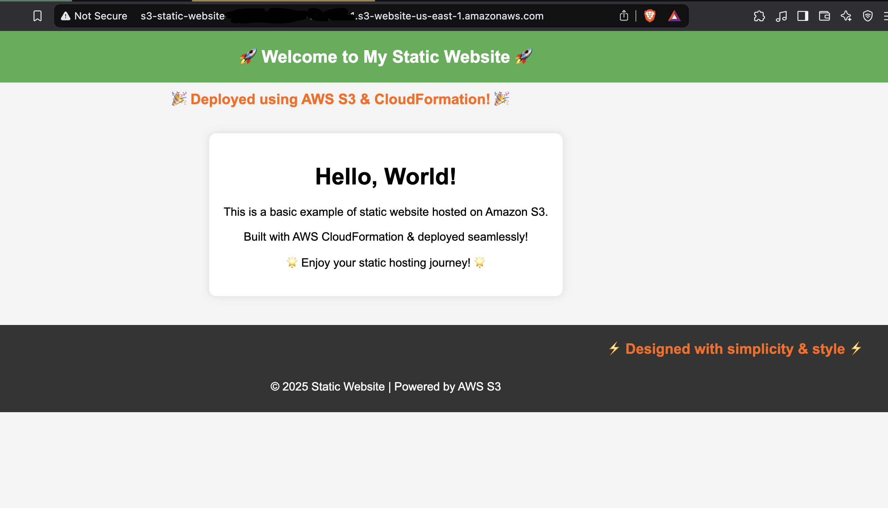

# 🚀 AWS S3 Static Website Deployment using CloudFormation  

This project demonstrates how to deploy a **static website** on AWS **S3** using **CloudFormation**.  

## 📜 Prerequisites  
Before deploying, ensure you have:  
- An **AWS Account**  
- **AWS CLI** installed & configured (`aws configure`)  
- **CloudFormation permissions** (`s3:CreateBucket`, `s3:PutBucketPolicy`, etc.)  

---

## 📂 Project Structure  
```
📁 s3-static-website
│── 📜 s3-static-website.yaml   # CloudFormation Template
│── 📜 index.html               # Home Page
│── 📜 error.html               # Custom 404 Page
│── 📜 README.md                # Project Documentation
│── 🖼️ index-preview.png        # Screenshot of the index.html page
```

---

## ⚙️ **CloudFormation Deployment**  

### 1️⃣ **Deploy the CloudFormation Stack**  
Run the following command to create the S3 bucket & configure website hosting:  
```bash
aws cloudformation create-stack --stack-name S3StaticWebsite --template-body file://s3-static-website.yaml --capabilities CAPABILITY_NAMED_IAM
```

### 2️⃣ **Upload Website Files to S3**  
Once the stack is created, upload `index.html` and `error.html` to the S3 bucket:  
```bash
aws s3 cp index.html s3://your-s3-bucket-name/
aws s3 cp error.html s3://your-s3-bucket-name/
```

### 3️⃣ **Get Website URL**  
Retrieve the static website URL from the CloudFormation output:  
```bash
aws cloudformation describe-stacks --stack-name S3StaticWebsite --query "Stacks[0].Outputs[?OutputKey=='WebsiteURL'].OutputValue" --output text
```
Alternatively, you can also get it from the **AWS S3 Console** under "Static Website Hosting."

---

## 🖼️ **Homepage Preview**
Below is a preview of the homepage:



